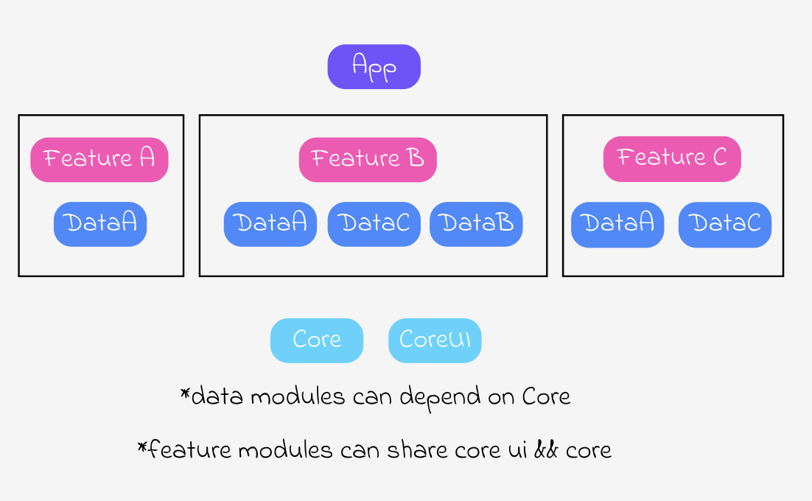

# Module Architecture with Dagger2

## Hierarchy

### Diagram

=====================================================
===================[app module]======================
=========================||===========================
===============[feature module (a)]==================
============||=====================||===============
======[data module (a)]=====[data module (b)]========
============||=====================||================
=======================[core]========================
=====================================================

### Thought Process / Rules

- dependencies always flow up
- app module dependent on feature modules
- feature modules are dependent on a collection of data modules
- data modules can only depend on a core module (cannot depend on each other)
- you do not have to create a data module for a feature whose data will not be shared.